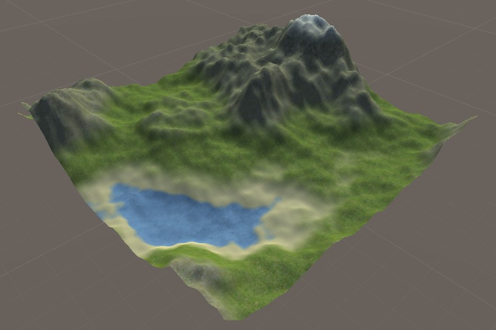

# Map generation based on Perlin noise
Terrain generator based on Pernil noise. It coud render map with custom settings of terrain structure.

## Table of contents
* [General info](#general-info)
* [Technologies](#technologies)
* [Status](#status)
* [Contact](#contact)

## General info
The project is realized as part of an engineering thesis in the field of Technical Physics with a specialization in Applied Computer Science at the Gdańsk University of Technology

The application is based on an algorithm that generates Perlin noise values in two dimensions, they are interpreted as the basis for the height of a given point. The obtained data are used to create a three-dimensional model from scratch, an elementary module of which the map consists (shown in the photo). The program sets successive vertices and, on their basis, defines the model's triangles, and also determines UV coordinates. Due to the possible high load of the processor, this process is performed with multiple threads. The generated models are combined into a whole map and then subjected to several processes to create a visually uniform whole. First, the height level for all slices is normalized to prevent delamination of the models at their boundaries. Then the normal models are recalculated taking into account the adjacent objects, thanks to which it is possible to avoid divergence of the default lighting system included in Unity. The application supports the LOD (Level Of Details) system, which means that the sections away from the centre, i.e. a controlled object controlled by the user, are generated with a lower quality, which has a positive effect on the smooth operation. Textures are applied to the environment prepared in this way. This is done with a shader, which additionally provides the effect of a smooth transition from one texture to another.

## Technologies
* Unity 2018.4.14f1
* C# 8

## Status
Project is: finished

## Contact
Created by Maciej Niklas
kontakt@mniklas.pl - feel free to contact me!
